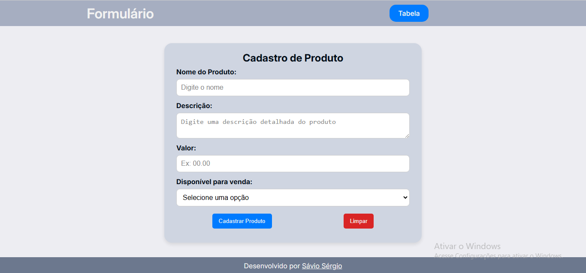
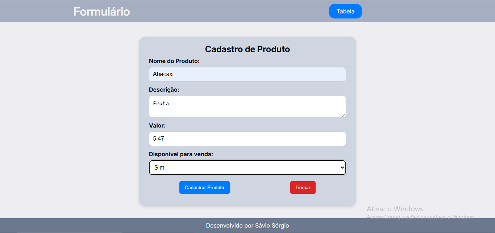
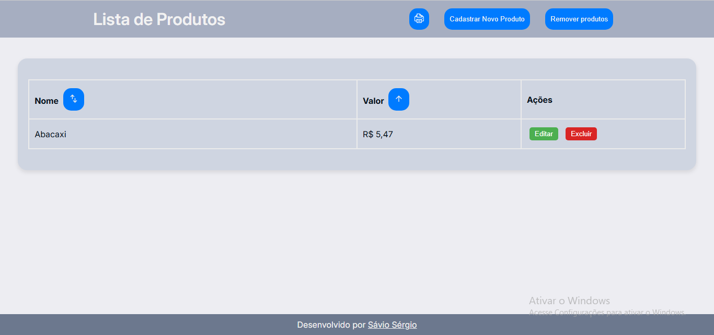
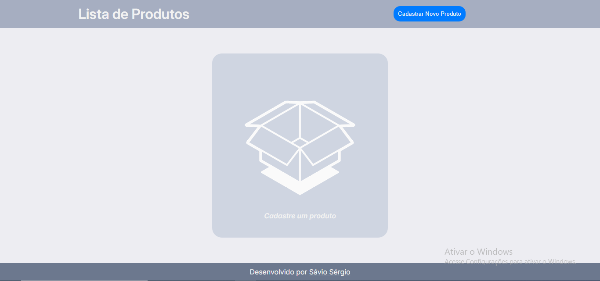

# Sistema de Cadastro e Listagem de Produtos

Este projeto é um sistema simples de cadastro e listagem de produtos, desenvolvido com **HTML**, **CSS** e **JavaScript**, utilizando o **localStorage** do navegador para persistência de dados.

## Funcionalidades

### Cadastro e Gerenciamento de Produtos

- **Cadastro de Produtos**: Permite cadastrar produtos com nome, descrição, valor e disponibilidade.
- **Listagem de Produtos**: Exibe os produtos cadastrados em uma tabela.
- **Ordenação**:
    - Ordenar produtos por **nome** (ascendente e descendente).
    - Ordenar produtos por **valor** (ascendente e descendente).
- **Edição de Produtos**: Modal para editar informações de produtos existentes.
- **Exclusão de Produtos**:
    - Remoção individual por botão.
    - Limpeza de todos os registros via botão dedicado.
- **Persistência de Dados**: Produtos são salvos e carregados automaticamente no localStorage do navegador.
### Funcionalidades Detalhadas do Script

1. **Carregamento Inicial**:
    - Verifica se há produtos salvos no localStorage. Se existirem, carrega e exibe os dados na tabela.
    - Caso contrário, oculta a tabela e exibe um alerta solicitando o cadastro de produtos.

1. **Atualização da Tabela**:
    - Recria dinamicamente as linhas da tabela a partir do array de produtos armazenado no localStorage.

2. **Ordenação**:
    - Ordena produtos por nome ou valor com alternância entre ordem ascendente e descendente. Indicadores visuais são alterados para refletir o estado da ordenação.

1. **Edição**:
    - Modal com formulário pré-preenchido para editar informações de um produto.
    - Atualiza os dados no localStorage e na interface após salvar as alterações.

1. **Exclusão**:
    - Permite excluir produtos individualmente, solicitando confirmação do usuário.
    - Atualiza os dados no localStorage e remove o item da tabela após a exclusão.

1. **Limpeza Geral**:
    - Remove todos os produtos do localStorage e recarrega a página para limpar a tabela.

## Estrutura do Projeto

- **index.html**: Página principal com o formulário de cadastro de produtos.
- **table.html**: Página secundária que exibe a tabela de produtos cadastrados.
- **script-table.js**: Script responsável pela manipulação de dados, eventos de interação com a tabela e persistência no localStorage.
- **css/style.css**: Arquivo de estilos gerais para o sistema.
- **css/impressora.css**: Arquivo dedicado à estilização para impressão da tabela.

## Como Usar

1. Abra o arquivo `index.html` em um navegador para cadastrar novos produtos.
2. Clique em **Tabela** no cabeçalho para acessar a lista de produtos cadastrados.
3. Na página da tabela:
    - Edite um produto clicando no botão **Editar**.
    - Exclua um produto clicando no botão **Excluir**.
    - Ordene os produtos por nome ou valor utilizando os botões de ordenação na tabela.
    - Limpe todos os produtos clicando no botão **Remover Produtos**.
    - Para imprimir a tabela, utilize a funcionalidade de impressão do navegador (Ctrl+P) ou o botão no header.

## Capturas de Tela

